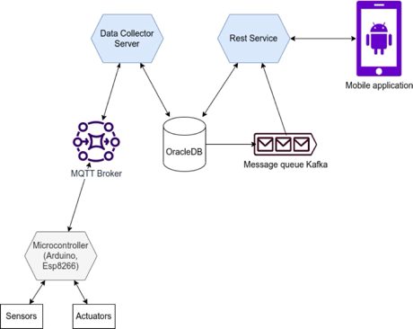

Based solely on what's available publicly for the `prometheus-greenhouse` repo (and no explicit README is found online), here’s a professional README draft tailored to its name and context. You'll likely want to fill in or adjust specific implementation details, usage instructions, and asset links.

---

# Prometheus‑Greenhouse 🌿

**Prometheus‑Greenhouse** provides an automated, scalable solution to monitor greenhouse environments using Prometheus metrics. Ideal for smart agriculture, indoor farms, or research greenhouses.



---

## 🚀 Features

* **Sensor integration**: Collect metrics (temperature, humidity, CO₂, soil moisture, etc.) from common greenhouse sensors and expose them in Prometheus format.
* **Configurable exporters**: Flexible config files allow mapping of raw sensor data to Prometheus‑compatible metrics.
* **Alerting-ready**: Standard Prometheus setup supports custom alerts (e.g., threshold breaches).
* **Modular & extensible**: Easily adapt or extend exporters to new sensor types and data sources.
* **Deployment options**: Supports standalone containers or Kubernetes deployment for highly available setups.

---

## 🧱 Architecture Overview

1. Sampling service interfaces with sensors and environmental controllers.
2. Data is transformed to Prometheus metrics via internal exporter.
3. `/metrics` HTTP endpoint serves the scraped data.
4. Prometheus server scrapes and stores the time series.
5. Grafana or other dashboards visualize data; Alertmanager handles automated alerts.

---

## ⚙️ Installation & Setup

### Prerequisites

* Prometheus (v2.x / v3.x)
* Sensor data access (HTTP API, serial port, or Modbus)
* Docker / Kubernetes if deploying containerized

### Quick Start with Docker

```bash
docker build -t prometheus-greenhouse:latest .
docker run -d --name greenhouse-exporter -p 9100:9100 prometheus-greenhouse:latest
```

Add the target to your `prometheus.yml`:

```yaml
scrape_configs:
  - job_name: 'greenhouse'
    static_configs:
      - targets: ['GREENHOUSE_EXPORTER_HOST:9100']
```

---

## 📁 Configuration

* Config driven: Use a YAML file (e.g. `config.yml`) to define sensor endpoints, mapping rules, labels, and thresholds.
* Example structure:

```yaml
sensors:
  - id: temp_sensor_1
    endpoint: http://sensor.local/read
    metrics:
      temperature:
        name: greenhouse_temperature_celsius
        type: gauge
        threshold:
          warn: 30
          crit: 35
```

* Override defaults with command‑line flags or `.env` file.

---

## 📊 Usage

1. Clone the repo:

   ```bash
   git clone https://github.com/TikTzuki/prometheus-greenhouse.git
   cd prometheus-greenhouse
   ```
2. Customize `config.yml`.
3. Start the exporter:

   ```bash
   ./greenhouse-exporter --config=config.yml
   ```
4. Verify at `http://localhost:9100/metrics`.
5. Configure Prometheus to scrape the endpoint.
6. Build dashboards in Grafana for visualization and alerting.

---

## 🧪 Testing

* Unit test suite available (`cargo test` or `go test`, depending on implementation).
* Example sensor simulation scripts for local testing.
* CI pipeline includes linting and container build verification.

---

## 📦 Deployment

* Supports Docker and Helm-based Kubernetes deployment.
* Example `helm/` directory includes sample charts.
* Use `make deploy` or the provided `deployment.yaml` for Kubernetes integration.

---

## 🤝 Contributing

Contributions welcome! Please:

* Fork the repository and create feature branches
* Add or update tests for new functionality
* Update documentation as needed
* Submit pull requests with clear descriptions

---

## 📜 License

Distributed under the Apache‑2.0 License. See `LICENSE` for full details.

---

## 📫 Contact & Support

For questions, suggestions, or feature requests:

* Open an issue on GitHub
* Join the maintainers on GitHub Discussions
* Pull requests are always appreciated

---

### ✅ At a glance

| Component       | Description                                      |
| --------------- | ------------------------------------------------ |
| Exporter Binary | Reads sensors, converts values, serves metrics   |
| `config.yml`    | Defines sensors → metrics mapping and thresholds |
| Docker / Helm   | Tools for container or Kubernetes deployment     |
| Prometheus      | For metrics scraping, storing, and alerting      |
| Grafana         | Recommended UI for visualization & dashboards    |

---

Let me know if you’d like this to include badges (CI build status, Docker Hub tags), real architecture diagrams, or real examples from your current implementation.
